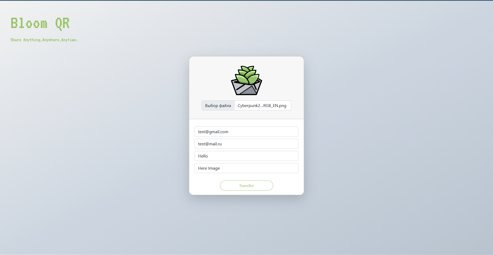

# BloomQR 
BloomQR is a File Transfering app that allows large file to be transfered easily over the internet.


## Installation
```bash
pip install -r requirements.txt
```
## Note 
This App is under development Phase.

## Test by Running
``` bash
python manage.py runserver
```
The website will be avalaible on 127.0.0:8000

## Application-Preview:

### Preview-1:


### Preview-2:


## How to launch website
1) Download ngrok and move to desktop
2) Launch cmd
3) Write cd C:\Users\user\Desktop 
4) Paste in cmd ngrok.exe config add-authtoken 2RNw1llV9rM8oOCZtfXqiTSe2sP_6E5aeah8hrfmDMh5UmoaV
5) Paste in cmd ngrok.exe http 8000
6) Go to settings.py and in CSRF_TRUSTED_ORIGINS paste ngrok link from cmd
7) Launch project in pycharm
